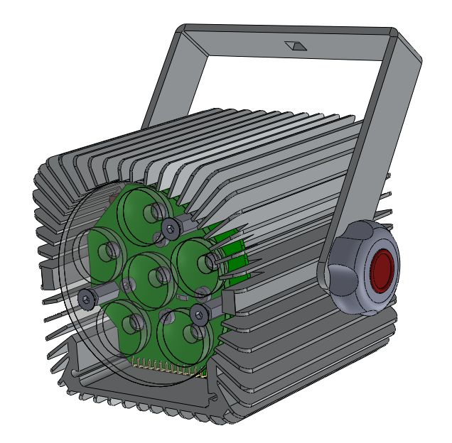

# SL5C

Spot light 5 colors DMX

[//]: 

  

# Datasheet

Total Power 40W

Warm Wite Power 20W

Cold White Power 5W

Red Power 5W

Green Power 5W

Blue Power 5W

Voltage 24V

Number of power LEDs RGBcW 4, Warm White 2 from CREE

Crontrol DMX

# Controller 

Atmel Arduino Leonardo Chip, Arduino code
